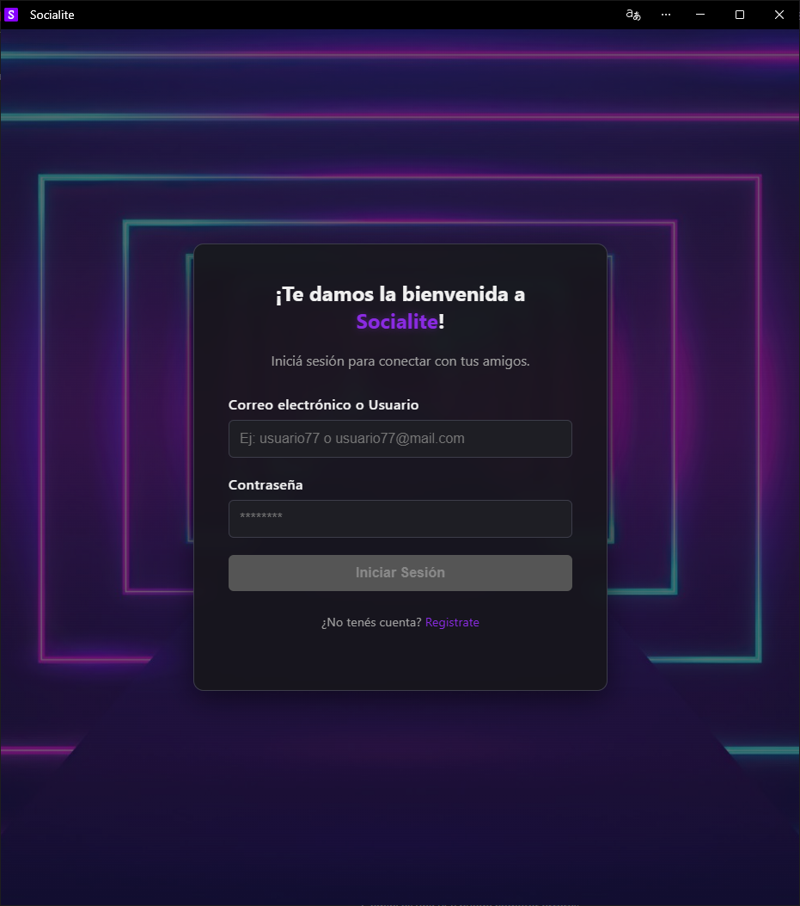
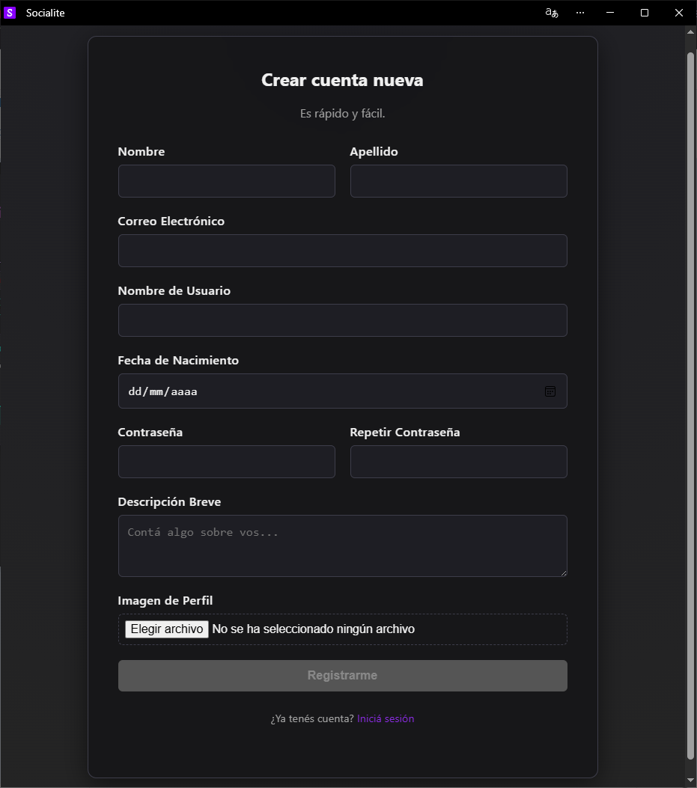
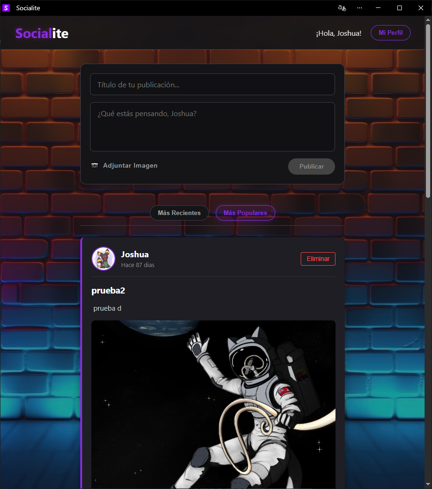
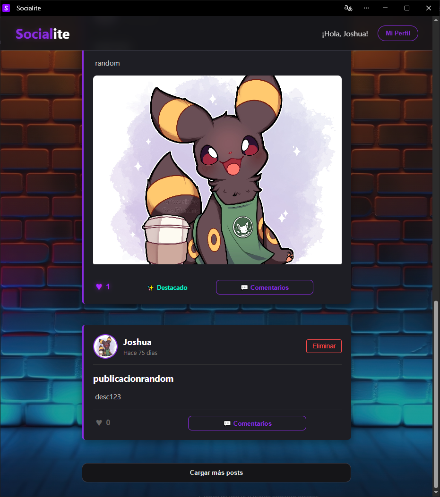
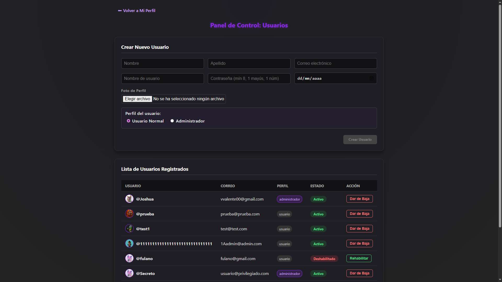
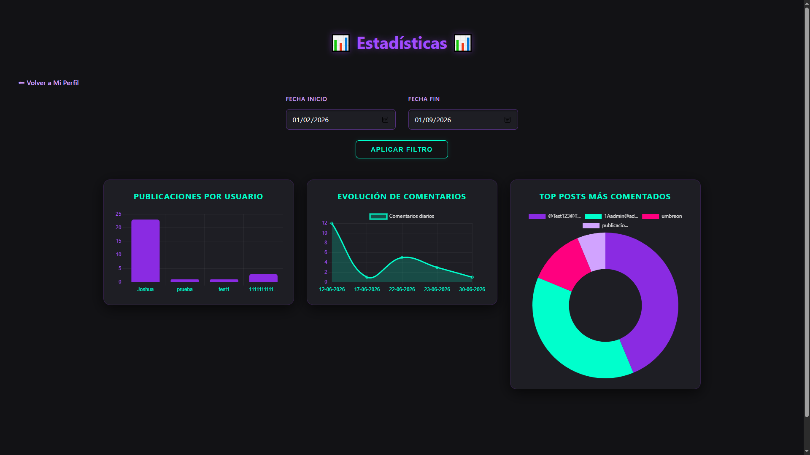

# Socialite - Progressive Web Application (PWA)

A full-stack responsive Progressive Web App (PWA) and social networking platform built with **Angular**, **NestJS**, and **MongoDB**. The application allows users to register, publish posts with cloud image uploads, interact across devices, and manage platform activity via an administrative dashboard with interactive analytics.

---

## Screenshots

### Authentication
| Sign In | Sign Up |
| :---: | :---: |
|  |  |

### Responsive Main Feed
| Desktop View | Mobile / Scaled View |
| :---: | :---: |
|  |  |

### Administration Panel
| User Management (CRUD & Roles) | Analytics & Metrics |
| :---: | :---: |
|  |  |

---

## Key Features

* **Progressive Web App (PWA):** Configured with `@angular/service-worker` for native-like installability, web manifest configuration, and offline asset caching.
* **Cloud Media Storage:** Stream-based image uploading for posts and user profiles integrated via **Cloudinary API**.
* **DTO Validation & Data Integrity:** Strict payload validation and sanitization using `class-validator` and `class-transformer`.
* **Interactive Analytics Dashboard:** Dedicated administrative view featuring 3 dynamic charts powered by **Chart.js** and **ng2-charts** to track platform metrics and user trends.
* **Admin Management Suite (RBAC):** Role-based access control enabling administrators to grant/revoke admin privileges and toggle user account statuses.
* **Secure Authentication & Sessions:** JWT authentication, bcrypt password hashing, HTTP-only cookies, and Angular Route Guards.
* **Responsive Layout:** Adaptive single-page application built with Angular and Angular CDK for desktop, tablet, and mobile support.

---

## Tech Stack

### Frontend
* **Core:** Angular, TypeScript, SCSS, HTML5
* **PWA & Layout:** `@angular/service-worker`, Angular CDK
* **Data Visualization:** Chart.js, ng2-charts
* **Tooling:** Angular CLI, Vitest, Prettier

### Backend
* **Framework:** NestJS (Node.js & Express)
* **Database & ODM:** MongoDB Atlas, Mongoose
* **Security & Auth:** JWT (`@nestjs/jwt`), bcrypt, cookie-parser
* **Media & Utilities:** Cloudinary, Streamifier, class-validator, class-transformer
* **Configuration & Deployment:** `@nestjs/config`, Vercel (Serverless Functions)

---

## Getting Started

### Prerequisites
* Node.js (v18 or higher recommended)
* Angular CLI installed globally: `npm install -g @angular/cli`

### Installation

1. **Clone the repository:**
   ```bash
   git clone [https://github.com/ValentinBrazanovich/Socialite.git](https://github.com/ValentinBrazanovich/Socialite.git)
   cd Socialite